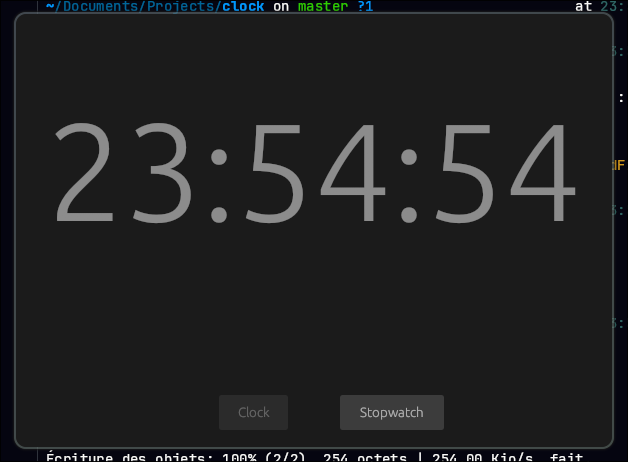

# Clock
Clock is a little clock application for my desktop.
> [!WARNING]
> We strongly advise against using Wayland to open the application, due to several problems with egui. If you're using Wayland, you can force XWayland to open the application, with `env -u WAYLAND_DISPLAY <command to open application>`.



## Why ?
When I switched to Arch and installed Hyprland, even though I'm basically a desktop user, I needed a stopwatch and a clock, two features that are important to me for my personal use of my computer. (and fuck gnome clock)

So I developed this little application that lets me have a clock and stopwatch at my fingertips.

## Build
To build the application, simply issue this series of commands:
```bash
git clone https://github.com/oriionn/clock.git
cd clock
cargo build --release
```
